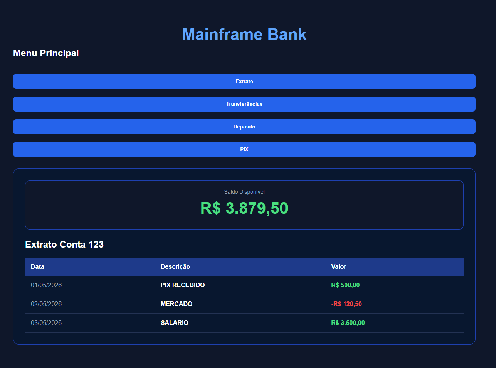
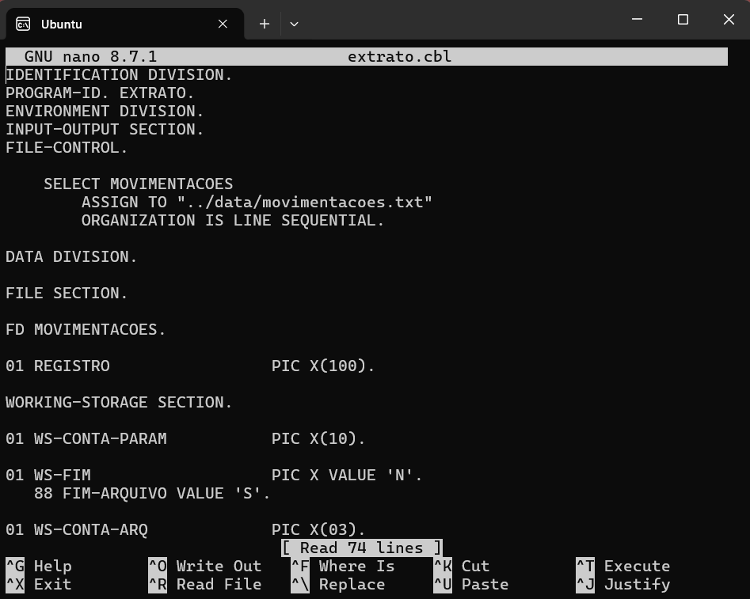
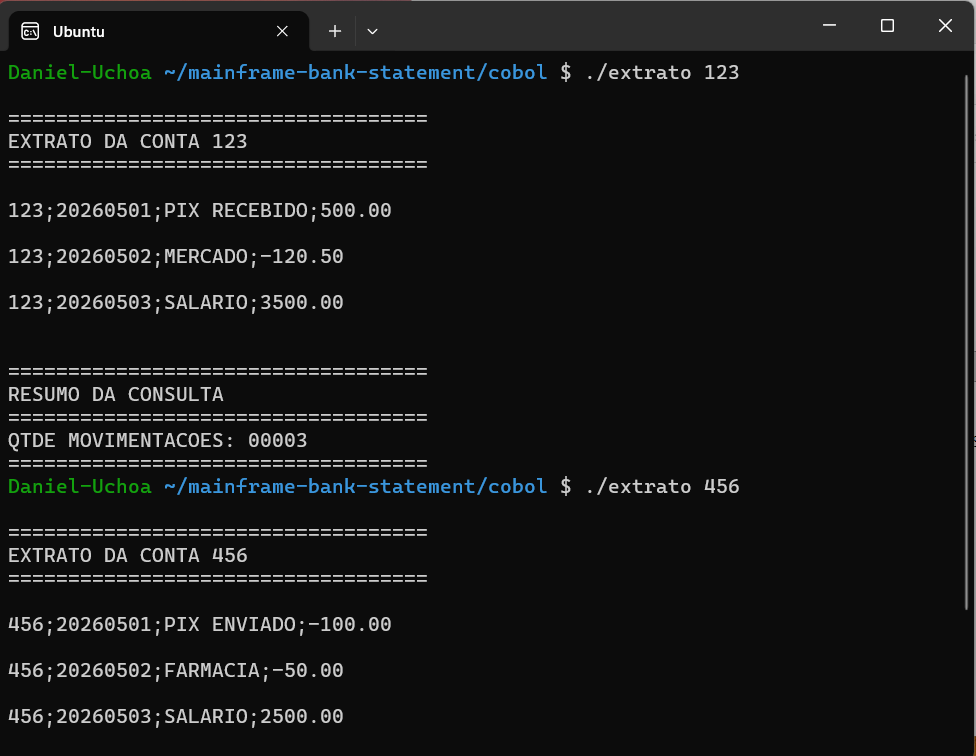

# Sistema Bancário - Extrato 

Projeto desenvolvido integrando aplicações modernas e sistemas legados utilizando COBOL.

A proposta foi simular um fluxo real de consulta de extrato bancário, conectando diferentes camadas da aplicação para demonstrar como tecnologias modernas podem consumir informações processadas por programas COBOL.

---

## Tela Inicial

---

## Codigo do Programa COBOL (GNU/Linux)

---

## Executando o programa via Linux

---

## Objetivo do Projeto

Mais do que executar um programa COBOL, o objetivo foi entender como integrar sistemas legados com aplicações modernas, reproduzindo desafios comuns encontrados em ambientes corporativos.

Durante o desenvolvimento foram explorados conceitos como:

- Integração entre sistemas
- APIs REST
- Comunicação entre aplicações
- Processamento de arquivos
- Linux para execução de programas COBOL
- Manutenção e evolução de sistemas legados
- Boas práticas de desenvolvimento

---

## Tecnologias Utilizadas

- COBOL
- Java
- Spring Boot
- Linux
- REST API
- JSON
- JavaScript
- HTML
- CSS

---

## Aprendizados

Um dos principais aprendizados deste projeto foi perceber que a complexidade muitas vezes não está na tecnologia isoladamente, mas na integração entre diferentes componentes sem impactar sistemas já existentes.

Também reforçou a importância de desenvolver pensando na manutenção futura do código, tornando as soluções mais sustentáveis e fáceis de evoluir.

---

## 👨‍💻 Autor

Daniel Uchôa

Analista de Sistemas com foco em desenvolvimento Mainframe, integração de sistemas e modernização de aplicações legadas.
